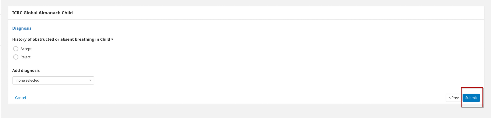

# Saving a Consultation

At the end of a consultation you will see a submit button, upon clikcing the submit button your consultation will be sumitted to the system.&#x20;

A consultation is not complete and not saved in the system until you click the submit button.&#x20;

If you start a new consultation before submitting the current consultation **your data will not be saved** and all entered data will be lost as soon as you start the new consultation.&#x20;

Therefore **make sure you click the submit button at the end of each consultation.**&#x20;

<figure><figcaption></figcaption></figure>
