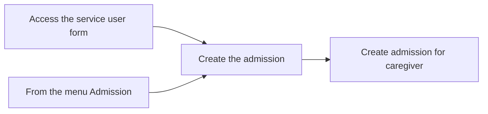

# Create an admission


Roles recommended : Dormitory manager


## **🧭** Context: 

Creating an admission for a Service User (SU) is a crucial administrative step that ensures proper coordination of accommodations and services. Each admission represents a defined period during which the SU is expected to stay in the facility. It allows staff to assign a bed, monitor presence, and manage logistics such as caregiver stays, meal planning, and room availability. This process also supports reporting and tracking, ensuring transparency and accountability in dormitory usage. Admissions must be created accurately to reflect the real-world presence of the SU and their companions.

## 🔄 Step-by-Step Flow

### Creation of the admission

To create an admission for a Service User (SU), you can either start from the SU form or from the Admission list.



On the home page, go to the icon "Service User Management".

<figure><figcaption></figcaption></figure>

You can view a list of all SU[^1]s here. Use the search bar at the top to find a patient by their name or SU[^1] ID. Please ensure to select the correct option.

<figure><figcaption></figcaption></figure>

Inside the Service User (SU) form, you’ll find a button labeled **"Create admission"**. Clicking this button will trigger the creation of the admission request.

<figure><figcaption></figcaption></figure>




On the home page, go to the icon "Service User Management".

<figure><figcaption></figcaption></figure>

At the top of the screen, in the header, you’ll find a menu labeled **“Admissions”** Click on it to open the Admission section, then click on **“Create New Admission”** to start a new admission process for a service user.

<figure><figcaption></figcaption></figure>



Now that the admission is created we need to fill in the information, first check/fill the service user field to ensure that you have selected the correct Service user.

Based on the patient's gender, the system will automatically select an appropriate ward (e.g., for a female patient, the Women’s Area will be selected).

<figure><figcaption></figcaption></figure>

### **Adding a Caregiver**

the Service User (SU) has a caregiver, go to the second tab labeled **"SU Companion."** In this tab, you can add admission records for caregivers and specify the dates they will be present. Each caregiver must be admitted individually, as their availability may vary.


Only caregivers previously created for this specific SU will be visible in this tab.


<figure><figcaption></figcaption></figure>

You can also add the same caregiver multiple times with different dates if they are present on different occasions.

<figure><figcaption></figcaption></figure>

### 🗺️ Visual Overview&#x20;

## What's next?&#x20;

8. Activating the Admission:
   * Once the admission is planned, click the "Activate" button at the top of the main admission record.
   * Also, select the small checkbox on the corresponding SU Companion Line for each caregiver.

<figure><figcaption></figcaption></figure>

* Plan Start and End dates can be entered as current, past or future.\
  Depending on those dates different behaviour of button will be:
*
  * Both dates are in past: the SU admission will be activated, admitted and discharged with planned dates.\
    Admission will end in state Discharged
  * Start date is in past, release date is in future: the SU will be admitted, the bed shown as occupied,\
    Admission will be in state Admitted
  * Both dates are in future: The selected bed will be shown as Planned (or reserved) for SU,\
    Admission will be in state Planned

8. Status Update:
   * After activation, the status of the admission record will change to "Plan" for both the main admission and the caregiver(s).

This process ensures that both the SU and their caregiver(s) are properly admitted with accurate tracking of dates and status.

[^1]: Service provider
