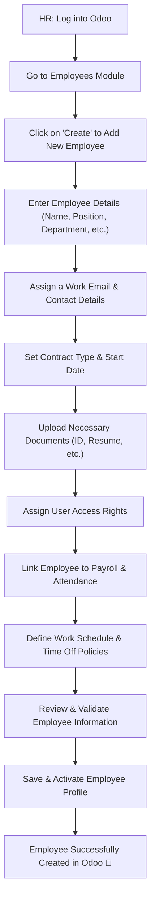

# Manage employee

```mermaid
graph TD;
    %% HR Initiates the Employee Creation
    A["HR: Log into Odoo"] --> B["Go to Employees Module"];
    B --> C["Click on 'Create' to Add New Employee"];

    %% Employee Information Entry %%
    C --> D["Enter Employee Details (Name, Position, Department, etc.)"];
    D --> E["Assign a Work Email & Contact Details"];
    E --> F["Set Contract Type & Start Date"];
    F --> G["Upload Necessary Documents (ID, Resume, etc.)"];

    %% System Configurations
    G --> H["Assign User Access Rights"];
    H --> I["Link Employee to Payroll & Attendance"];
    I --> J["Define Work Schedule & Time Off Policies"];

    %% Final Validation & Activation
    J --> K["Review & Validate Employee Information"];
    K --> L["Save & Activate Employee Profile"];
    L --> M["Employee Successfully Created in Odoo 🎉"];

```

