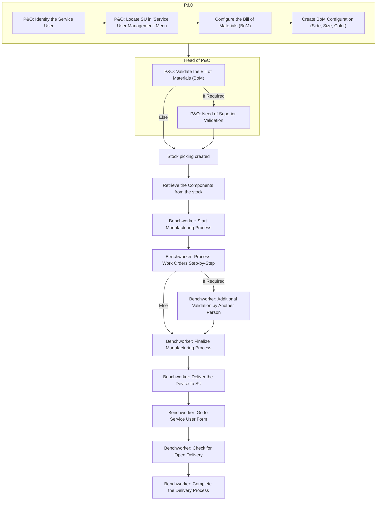

# Materials request (MRP)

In this section, we will explain the flow of the Manufacturing Resource Planning (MRP) process in Odoo, specifically for handling a service user requests for medical devices such as prostheses, orthotic, crutches, wheelchairs, walking aids or other materials.

## Prerequisite

The process begins when a service user requests a specific device. This triggers a series of steps to ensure the requested item is properly configured, manufactured, and delivered.

## MRP Process Flow



### Identify the service user

Locate the service user in the "Service User Management" menu.



### Configure the Bill of Materials (BoM)

Create a BoM configuration to define the product attributes (e.g., side, size, color).



### Validate the Bill of Materials (BoM)

Confirm the configuration. In some cases, a superior’s validation is required to proceed with the manufacturing order.



### Stock Allocation

Retrieve the necessary components by moving stock from daily usage inventory to the workshop.



### Manufacturing Process

* Start the manufacturing order.
* Process each work order step-by-step.
* In certain cases, an additional validation by another person may be required.



### Complete the manufacturing Order

Finalize the manufacturing process once all work orders are completed.



### Deliver the Device to the SU[^1]

* Go to the service user form.
* Check for an open delivery and complete the delivery process.



## Flow chart

<figure><figcaption></figcaption></figure>

[^1]: Service User
