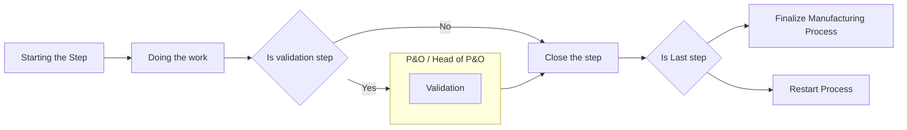

# Work order

Inside the **Manufacturing Order**, you will find a tab called **"Work Orders"**.

<figure><figcaption></figcaption></figure>

This tab contains all the steps that need to be completed by the workshop. The user must progress through each Work Order step by step before the manufacturing process is complete..

<figure><figcaption></figcaption></figure>

Each step has a “Start”/ ”Block” button.

·       When starting a Work Order, a timer will begin until the user “Pauses” or marks it as “Done”.

·       This will help to track the time for each step.


Currently only 1 person can start the step even if there is multiple person working on it.


<figure><figcaption></figcaption></figure>

If the Tier Validation module is installed and the Work Order stage is Greenlight or any other validation step, only specific users will be able to validate this step. The user must request validation for this step by clicking the "Request Validation" button.  They will need to wait for approval before proceeding to the next step.

<figure><figcaption></figcaption></figure>

This process may vary depending on the center's configuration. The validation settings are directly managed within the Tier Validation module. To check the configuration, you can refer to the module settings.

_Example:_

In this example I’m connected as “Head of clinician”, the only role that can approve this step.

<figure><figcaption></figcaption></figure>

<figure><figcaption></figcaption></figure>

