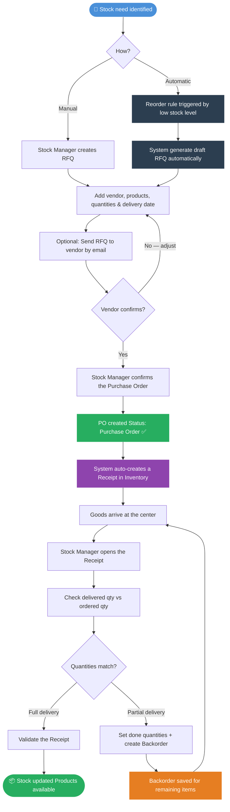

# Purchase

### 🔄 Purchase Workflow Overview

This flow describes the **complete purchase process**, starting from the identification of a stock need to the final receipt of products into the warehouse. It covers both **manual purchases** initiated by the Stock Manager and **automatic purchases** triggered by reorder rules configured by the DCMS Administrator.

1. **Configuration (One-time Setup)** Before any purchase can be made, the system must be correctly configured. The DCMS Administrator sets up vendors as contacts in the system and ensures each product has the correct purchase settings — including the vendor, unit price, and delivery lead time. This step only needs to be done once per vendor or product.
2. **Create a Request for Quotation (RFQ)** The process begins when a stock need is identified — either manually by the Stock Manager, or automatically by the system when a product's stock level drops below a defined threshold. An RFQ is created, listing the products and quantities to be ordered from a specific vendor. At this stage, no commitment has been made — the RFQ is simply a draft proposal.
3. **Confirm the Purchase Order (PO)** Once the quantities and prices have been reviewed and agreed upon, the Stock Manager confirms the RFQ, turning it into a **Purchase Order**. This is the formal commitment to purchase. The system automatically creates a corresponding **Receipt** in the Inventory module, ready to be processed when the goods arrive.
4. **Receive the Products** When the ordered items physically arrive at the center, the Stock Manager opens the Receipt linked to the Purchase Order, verifies the delivered quantities against what was ordered, and validates the receipt. This step updates the stock levels and makes the products available for manufacturing or delivery.

This flow ensures **full traceability of purchased items**, **accurate inventory levels**, and a clear **audit trail** between what was ordered and what was received.


If your center uses **automatic replenishment**, the RFQ is created automatically by the system when stock falls below a minimum threshold. The confirmation and receiving steps remain the same.

👉 [See Automatic Replenishment](../stock-management/how-to-create-automatic-replenishment.md)


***

### 🗺️ Visual Overview

***

### 👥Who Does What

| Step                             | Role               |
| -------------------------------- | ------------------ |
| Configure a Vendor               | DCMS Administrator |
| Configure a Product for Purchase | DCMS Administrator |
| Create an RFQ                    | Stock Manager      |
| Confirm the Purchase Order       | Stock Manager      |
| Receive the Products             | Stock Manager      |
