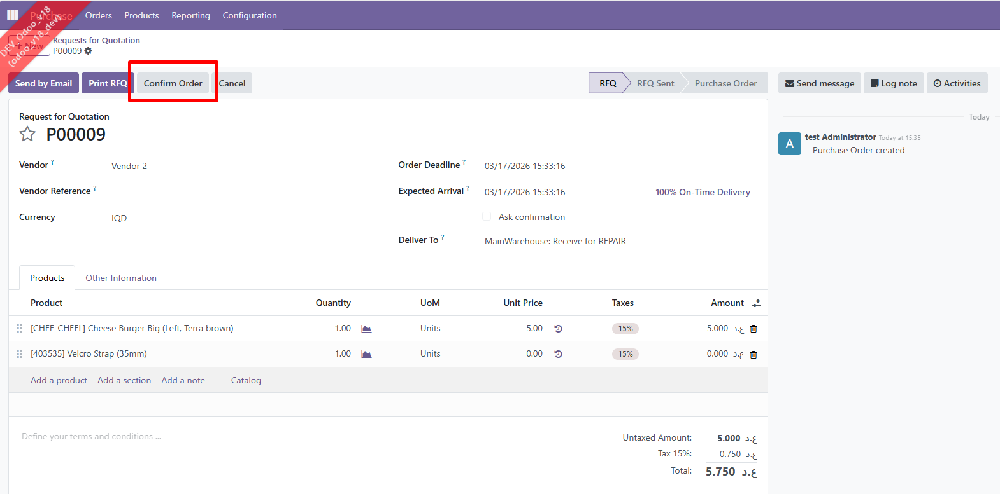
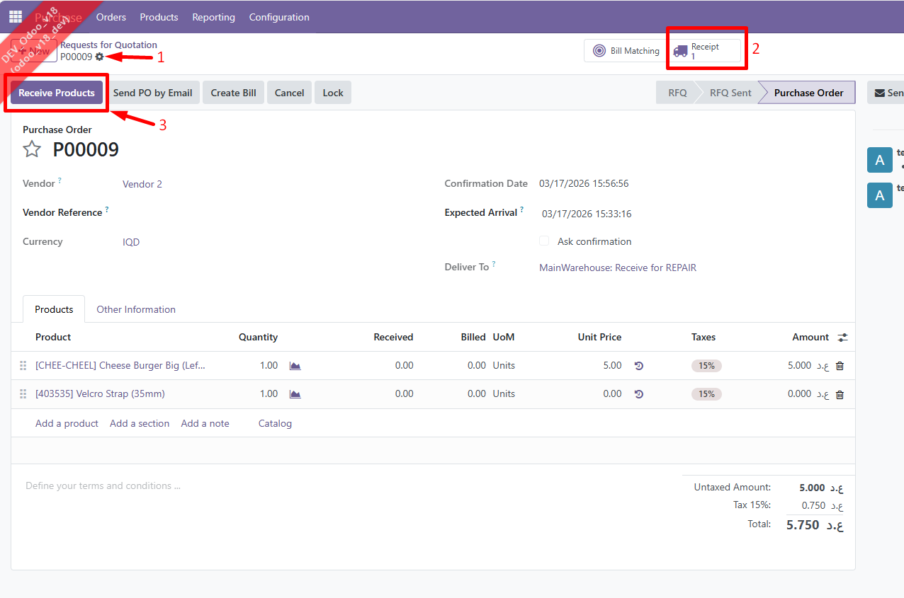

# Confirming a Purchase Order

Once the details of the RFQ such as the selection of the vendor, products and their prices and quantities have been checked and confirmed, you can proceed with **confirming the Purchase Order (PO)**.&#x20;

<figure><figcaption>
An RFQ prior to confirming the Purchase Order (PO)
</figcaption></figure>

***

Once the **PO** is confirmed, you will have the option to print it as .pdf **(1)**, view the receipt that has been created for it **(2)** and once the products have been delivered, you will have the option of confirming this by receiving the products **(3).** This will open a stock move to receive the products, and will be discussed in the next section.&#x20;

<figure><figcaption>
A confirmed PO 
</figcaption></figure>

