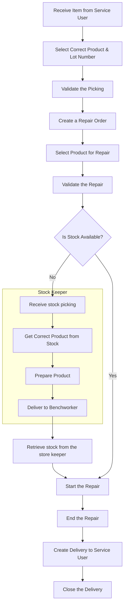

# Repair Process

<figure><figcaption></figcaption></figure>

```mermaid
flowchart TD
 subgraph askProduct["Stock Keeper"]
        G0["Receive stock picking"]
        G2["Prepare Product"]
        G1["Get Correct Product from Stock"]
        G3["Deliver to Benchworker"]
  end
    A["Receive Item from Service User"] --> B["Select Correct Product & Lot Number"]
    B --> C["Validate the Picking"]
    C --> D["Create a Repair Order"]
    D --> E["Select Product for Repair"]
    E --> F["Validate the Repair"]
    F --> n1["Is Stock Available?"]
    G1 --> G2
    G2 --> G3
    G["Retrieve stock from the store keeper"] --> H["Start the Repair"]
    H --> I["End the Repair"]
    I --> J["Create Delivery to Service User"]
    J --> K["Close the Delivery"]
    n1 -- No --> G0
    n1 -- Yes --> H
    G3 --> G
    G0 --> G1

    n1@{ shape: diam}

```

