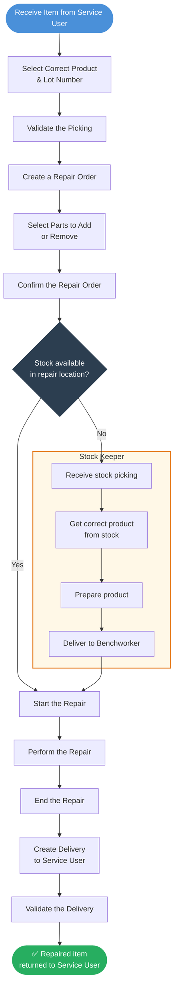

# Repair Workflow

This flow describes the **complete repair process**, starting from the reception of the item from the Service User (SU) to the final delivery of the repaired product. It includes the interaction between the technician and the **Stock Keeper**, who plays a crucial role in managing stock availability and product preparation.

1. [**Reception & Repair Initiation**](get-the-product-to-repair.md)\
   The process begins when the Service User returns the item for repair. The technician selects the correct product and associated Lot Number, then validates the picking to confirm receipt.&#x20;
2. [**Repair Order Configuration**](create-the-repair-request.md)\
   A repair order is being created. In the repair form, the technician selects the product that needs to be repaired and validates the repair setup.
3. [**Stock Check & Preparation**](prepare-the-componenent-used-in-repair.md)\
   The system checks if the required parts or materials for the repair are available in stock:
   * **If not available**, a stock picking is created and sent to the **Stock Keeper**, who prepares the necessary items.
   * The Stock Keeper retrieves the correct product from stock, prepares it, and delivers it to the **benchworker**.
4. [**Repair Execution**](start-the-repair-process.md)\
   Once the needed items are available, the technician starts and performs the repair.
5. [**Delivery of Repaired Product**](deliver-the-repaired-item.md)\
   After the repair is completed, a delivery is created to return the repaired item to the Service User. Once validated, the delivery is closed, and the product is officially returned to the SU.

This flow ensures **traceability of parts**, **accurate inventory movement**, and clear **role separation** between stock management and repair execution.

### 🗺️ Visual Overview  

### 👥 Who Does What

| Step                         | Action                                                   | Role                      |
| ---------------------------- | -------------------------------------------------------- | ------------------------- |
| Get the product to repair    | Create the stock picking (receive item from SU)          | P\&O / Benchworker        |
| Get the product to repair    | Select product, lot number and validate the receipt      | P\&O / Benchworker        |
| Create the repair request    | Create the Repair Order and select parts to add / remove | P\&O / Benchworker        |
| Create the repair request    | Confirm the Repair Order                                 | P\&O / Benchworker        |
| Start the repair process     | Click "Start Repair" to trigger the resupply move        | Benchworker               |
| Start the repair process     | Validate the "Resupply Repair" stock transfer            | Storekeeper               |
| Start the repair process     | Perform the repair and click "End Repair"                | Benchworker               |
| Quality control _(optional)_ | Fill in the QC inspection checklist                      | Benchworker               |
| Quality control _(optional)_ | Approve or reject the quality check                      | Head of P\&O / Supervisor |
| Deliver the repaired item    | Click "Deliver Item" to create the delivery order        | Benchworker / Storekeeper |
| Deliver the repaired item    | Validate the delivery and return product to the SU       | Benchworker / Storekeeper |
