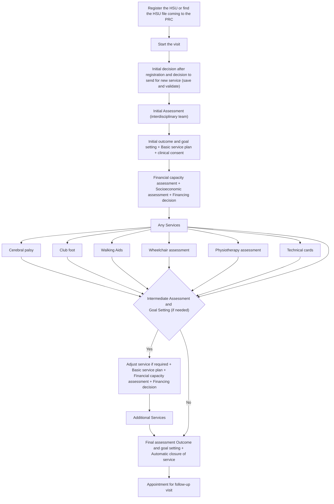

# HSU Journey and Workflows

We have 2 main workflows&#x20;

1. New Service
2. Follow up/repair&#x20;

###



### (if necessary) Intermediate Assessment Outcome and Goal setting

Decision: Adjust service if required

Basic service plan

Financial capacity assessment (+Socioeconomic already recorded) and Financing decision&#x20;



**Service (s)**&#x20;



### Final assessment Outcome and goal setting (Automatic closure of service)

Appointment for follow up visit











### &#x20;Workflow Follow up/Repair



### Register the HSU or find the HSU file coming to the PRC&#x20;




### Start the visit (Open the Episode of service)

Initial decision after registration and decision to send for follow up (save and validated)



### Service Follow up Assessment&#x20;

Decision: Follow up/repair or New Interdisciplinary assessment or end the follow up



### Financial capacity assessment

If not approved complete the socioeconomic already recorded&#x20;

* decision&#x20;



### Service Follow up Plan (Automatic closure of Episode of service)

If AT repair is yes, select the pertinent service category options with the Adjustment or/and Repair as service.




*

