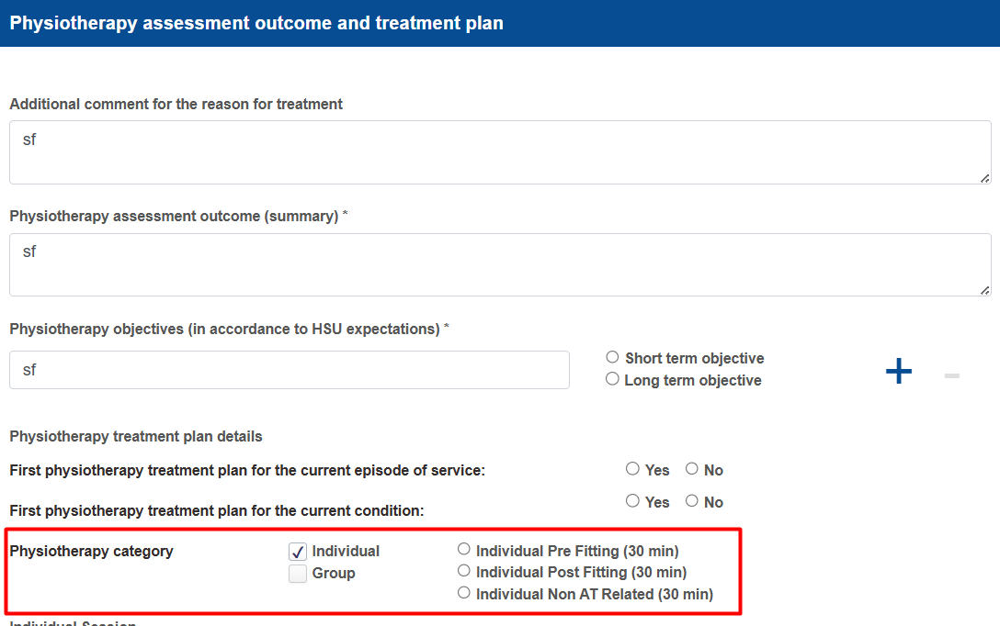

# Physiotherapy New Service Workflow

When completing the New Service workflow, there are three main steps to complete the physiotherapy service:

1. Physiotherapy Assessment, Outcome and Treatment Plan
2. Physiotherapy Treatment Session Record
3. Physiotherapy Outcome and Treatment Conclusion

### 1. Physiotherapy Assessment, Outcome and Treatment Plan

The first step is to complete the Physiotherapy Assessment, Outcome and Treatment Plan.

This form is used to define the physiotherapy assessment and treatment plan and to select the appropriate physiotherapy category.

The physiotherapist must determine whether the service is Individual (Pre fitting, Post fitting or Non AT Related) or Group.

The selected category determines the type of physiotherapy service to be provided.

<figure><figcaption></figcaption></figure>

### 2. Physiotherapy Treatment Session Record

Once the assessment and treatment plan have been established, the physiotherapist records each treatment session using the Physiotherapy Treatment Session Record.


**A separate Treatment Session Record must be completed for each session**.


The physiotherapist should record the relevant information for each session, including the required treatment details shown in the form.

The number of Treatment Session Records depends on the patient's treatment plan and the number of sessions required for the selected physiotherapy category.

<figure><figcaption></figcaption></figure>

Once all required treatment sessions have been completed, proceed to the **Physiotherapy Outcome and Treatment Conclusion**.

### 3. Physiotherapy Outcome and Treatment Conclusion

After completing all required treatment sessions, complete the Physiotherapy Outcome and Treatment Conclusion.

This form is used to record the outcome and conclusion of the physiotherapy service.

The physiotherapist first identifies the category that has been completed, for example:

* **Pre fitting**
* **Post fitting**
* **Non AT Related**

<figure><figcaption></figcaption></figure>

Based on the outcome of the completed physiotherapy service, the physiotherapist determines the next step:

* <mark style="color:blue;">Continue physiotherapy services</mark>

If another physiotherapy category is required, the physiotherapist can start the process again by selecting the appropriate category.

For example, after completing the Pre fitting category, the physiotherapist may determine that Post fitting physiotherapy sessions are required.

In this case, the physiotherapist completes the Physiotherapy Assessment, Outcome and Treatment Plan again and selects Post fitting as the physiotherapy category.

* <mark style="color:blue;">End physiotherapy services</mark>

If no further physiotherapy intervention is required, the physiotherapy service can be concluded.

* <mark style="color:blue;">Referral</mark>

If the patient requires further care or another service, the patient can be referred to the appropriate service.
