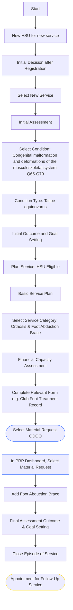
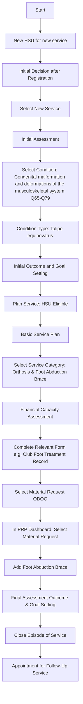

# Workflow for Club Foot treatment


In this scenario; the HSU will only receive the Foot Abduction Brace, as the serial casting (or Ponseti) will be performed in a medical setting (with sometimes a tenotomy).


For a new HSU who will need a Foot Abduction Brace;

### **Service Flow Overview**

1. **Start**
2. **New HSU for new service**
3. **Initial Decision after Registration**

<mark style="color:orange;">Select New Service</mark>

1. **Initial Assessment**
2. **Condition Selection:**
   * _Congenital malformation and deformations of the musculoskeletal system (Q65–Q79)_
   * → **Talipe Equinovarus**
3. **Initial Outcome and Goal Setting**

<mark style="color:orange;">Plan Service: HSU Eligible</mark>

1. **Basic Service Plan**
2. **Select Service Category:**
   * _Orthosis & Foot Abduction Brace_
3. **Financial Capacity Assessment (+socioeconomic assessment and financing decision)**

<mark style="color:orange;">Approve service</mark>

1. **Services**
   * Complete the relevant form (in our scenario we select the first one in bold).
     * **Club foot treatment record, assessment & cast follow up** _You can complete multiple forms to enable the monitoring of the Pirani score ._
     * Club foot treatment record tenotomy decision&#x20;
     * Club foot treatment record post tenotomy follow up
     * Club foot post tenotomy functional outcomes
2. **Material Request Process:**
   * Select Material Request in ODOO
   * Use PRP Dashboard → Add Foot Abduction Brace
3. **Final Assessment Outcome & Goal Setting**

<mark style="color:orange;">Close Episode of Service</mark>

1. **Appointment for Follow-Up Service**

The HSU comes back for the follow up visit, and will have different options through this workflow "follow up"


We can have a Foot Abduction Brace renewal as an exception within this workflow to ease the clinician workload.&#x20;


1. **Start EoS**
2. **Initial Decision after registration**

<mark style="color:orange;">Select follow up</mark>

1. **Service follow up assessment**

<mark style="color:orange;">Follow up decision</mark>

1. **Bracing club foot treatment**
2. **Select**
3. **Financial capacity assessment - follow up**
4. **Club foot treatment record, brace compliance follow up**
5. **Brace size decision**
   * If **Good** → go to **Service follow up plan**
   * If **To be changed** → go to **Material Request**
6. **Do we have devices to be repaired during this visit?**
   * If **No** → **Save and validate**
   * If **Yes**:
     * **Select the device and repair type**
     * **Orthosis / LL bilateral**
     * **Adjustment or Repair**
7. **EoS (End of Service)**



### Initial Decision after registration

Decision for Follow up workflow&#x20;



### Follow up Service (start visit)&#x20;

For monitoring, shoe changes, adjustment, repair, or renewing a foot abduction brace within 1-2 weeks, the Episode of service can close at month's end to include follow-up visits.



### Clubfoot treatment record, brace compliance follow up

* if you renew the Foot Abduction Brace; in the decision section you select "to be changed"

OR

* if the brace size is good, you just need to do an adjustment or repair, you save the form and complete the service follow up plan.&#x20;



### Material Request (ODOO)

in PRP dashboard, you select the material request



### Service Follow-up plan

In the case of Foot Abduction Brace renewal;&#x20;

You answer if there is AT repair is "no":

*   Maintain HSU activity for 4 weeks between the 1st and 3rd braces to facilitate PRC and caregiver adjustments.

    If issues persist, consider returning for recasting.
* If follow-up visits are spaced three weeks or more apart, or fall into different months, the episode should be closed.

**OR**&#x20;

* If you had an adjustment or repair, you select "yes" to answer to the question AT repair.



### Close and Save Service follow up plan to close the Service workflow follow up/repair.




