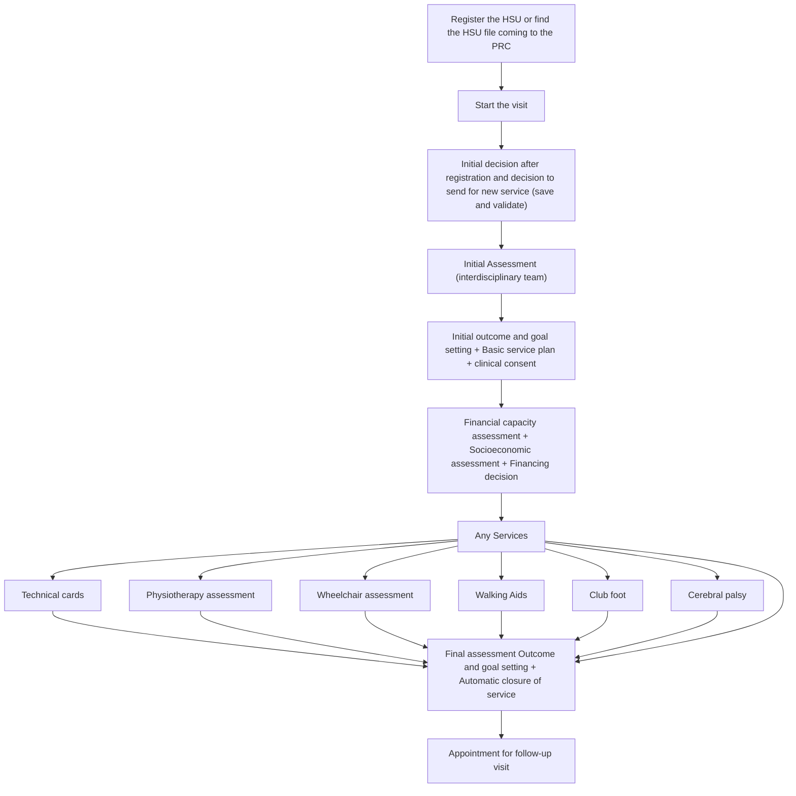

# Workflow User Journey Case study

```mermaid
flowchart TD
    A["Register the HSU or find the HSU file coming to the PRC"] --> B["Start the visit"]
    B --> C["Initial decision after registration and decision to send for new service (save and validate)"]
    C --> D["Initial Assessment (interdisciplinary team)"]
    D --> E["Initial outcome and goal setting + Basic service plan + clinical consent"]
    E --> F["Financial capacity assessment + Socioeconomic assessment + Financing decision"]
    F --> G["Any Services"]
    
    G --> G1["Technical cards"] --> K
    G --> G2["Physiotherapy assessment"] --> K
    G --> G3["Wheelchair assessment"] --> K
    G --> G4["Walking Aids"] --> K
    G --> G5["Club foot"] --> K
    G --> G6["Cerebral palsy"] --> K
    G --> K["Final assessment Outcome and goal setting + Automatic closure of service"]
        K --> L["Appointment for follow-up visit"]

```
