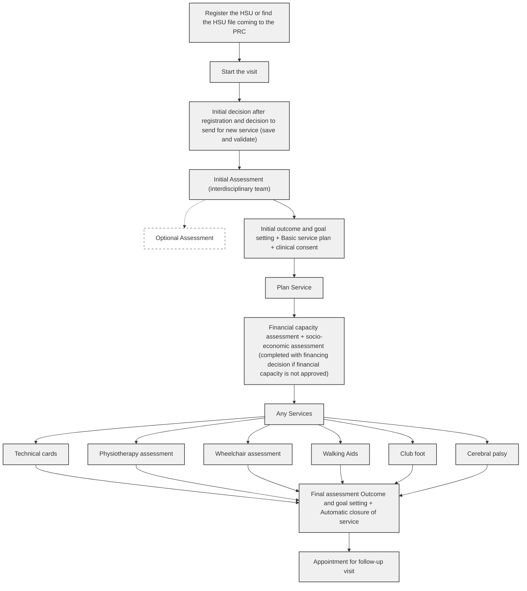

# Workflow User Journey

Register the HSU or find the HSU file coming to the PRC

### a. Workflow new service&#x20;



### Start the visit

<mark style="color:green;">Initial decision after registration</mark> and decision to send for new service (save and validate)



### Initial Assessment (interdisciplinary team)

* <mark style="color:green;">Initial outcome and goal setting (optional assessments)</mark>
* <mark style="color:green;">Basic service plan + clinical consent (plan service)</mark>



### Financial capacity assessment

<mark style="color:green;">(if not approved) Socioeconomic assessment+ Financing decision</mark>



### Services&#x20;

Technical cards

Physiotherapy assessment

Wheelchair assessment

Walking Aids

Club foot

Cerebral palsy



### Final assessment Outcome and goal setting (Automatic closure of service)

Appointment for follow up visit



### b. Workflow new service with intermediate assessment&#x20;

**In the case you need to adjust the service;**

* To add a product or additional service (such as additional physiotherapy sessions)
* To assess the progress and the objectives of the treatment; you can follow the next step.&#x20;



### Service&#x20;

Physiotherapy, Technical card, Wheelchair, Club Foot, Cerebral Palsy, Walking aids



### Intermediate Assessment Outcome and Goal setting

Decision: Adjust service if required&#x20;



### Basic Service Plan




### Financial Capacity Assessment&#x20;

if not approved:

* Select make **socio-economic** and complete **FInancing Decision**
* Select **Socio-economic** already recorded, if you select this option you can already go to F**inancing Decisio**n



### Service (s)



### Final assessment Outcome and goal setting (Automatic closure of service)

Appointment for follow up visit


